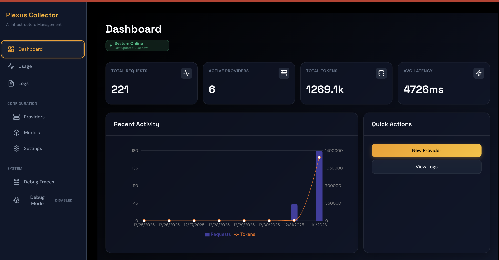
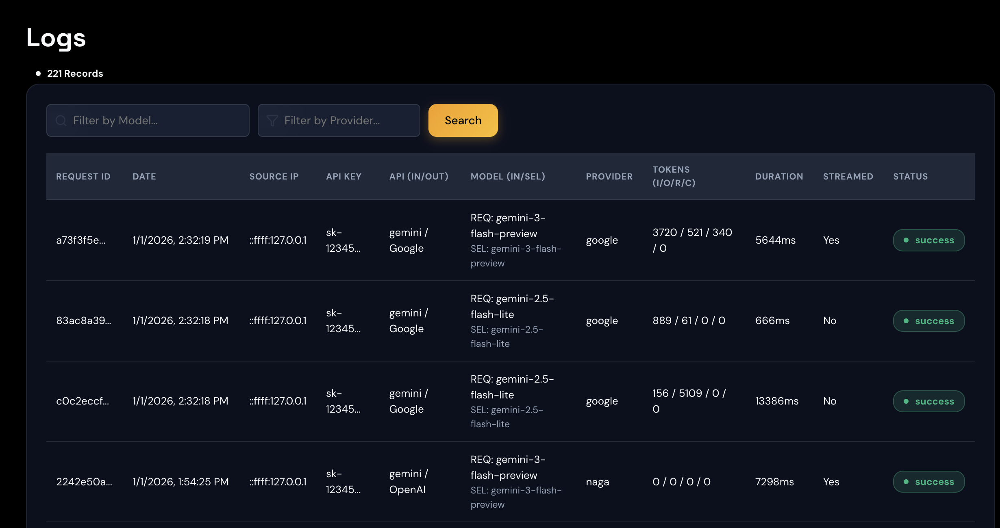
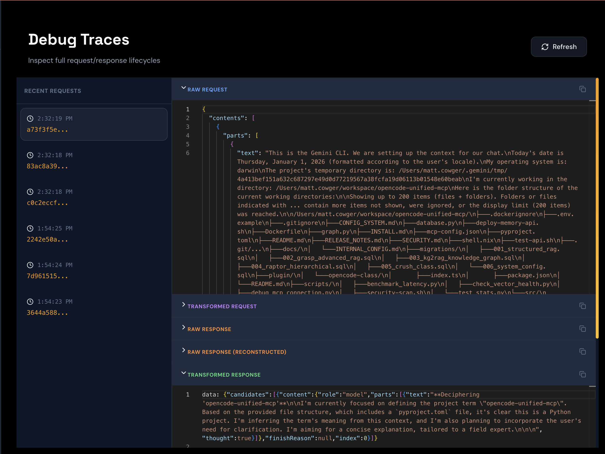
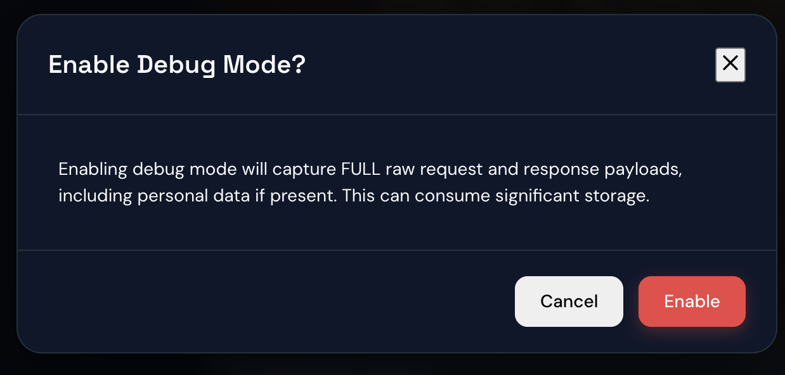
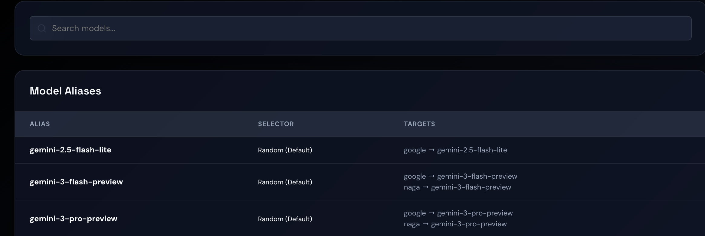
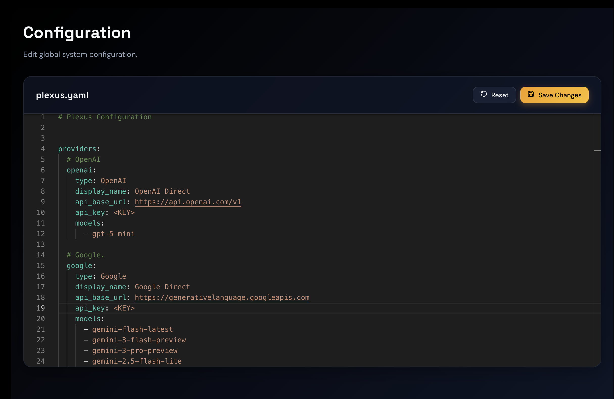
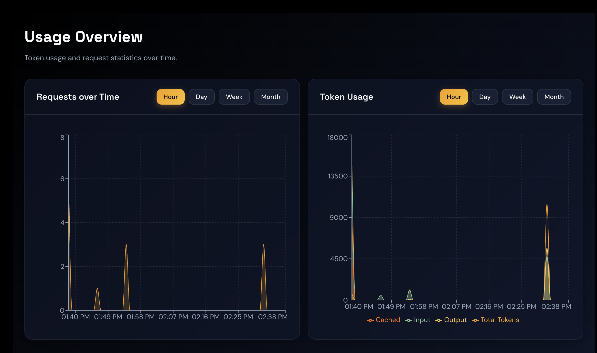

# Plexus

**A Universal LLM API Gateway & Transformation Layer.**


### [🚀 API Reference](docs/API.md) | [⚙️ Configuration Guide](docs/CONFIGURATION.md) | [📦 Installation Guide](docs/INSTALLATION.md)

Plexus unifies interactions with multiple AI providers—OpenAI, Anthropic, Gemini, and more—under a single, standard API. It handles protocol translation, load balancing, and observability, allowing you to switch models and providers without rewriting your client code.



## Core Features

### Protocol Support & Transformation
- **Unified API**: OpenAI (`/v1/chat/completions`), Anthropic (`/v1/messages`), and Gemini endpoints with full image support
- **Multi-Protocol Providers**: Configure providers with multiple API endpoints (e.g., both OpenAI and Anthropic formats)
- **Intelligent Protocol Transformation**: Seamlessly convert between provider formats with robust state-machine-based streaming, powered by Fastify
- **Pass-through Optimization**: Automatically bypasses protocol conversion when formats match, reducing latency while maintaining observability (⚡ icon in logs)

### Routing & Load Balancing
- **Model Aliasing**: Map friendly names to specific provider/model combinations
- **Smart Routing**: Distribute requests across backends with multiple strategies (random, cost, performance, latency) and automatic cooldown for unhealthy providers
- **API Priority Matching**: Optionally filter providers by native API compatibility before applying selection strategies for maximum fidelity

### Observability & Management
- **Performance Tracking**: Real-time monitoring of TTFT, TPS, and error rates across all providers
- **Cost Management**: Track costs with multiple pricing strategies (simple, OpenRouter, tiered)
- **Deep Debugging**: Capture and inspect raw requests, responses, and stream reconstruction
- **Reasoning Support**: Unified handling of thinking content from models like Gemini and Claude

### Security & Authentication
- **API Key Authentication**: Standard Bearer token authentication for all inference endpoints
- **OAuth 2.0 Support**: Use your Google Antigravity account (supporting Pro, Ultra, and Free accounts) with automatic token refresh—no API keys required
- **Secure Dashboard**: Admin key protection for management APIs and web interface

## Performance Metrics & Observability

Plexus continuously monitors the health and performance of every upstream provider and model. It maintains a rolling window of recent metrics, which powers the intelligent routing engine and provides deep visibility into your LLM infrastructure.

- **Time to First Token (TTFT)**: Tracks responsiveness, crucial for interactive applications.
- **Tokens Per Second (TPS)**: Measures overall throughput for each model.
- **Real-time Cost Calculation**: Precise cost tracking for every request, visible in the dashboard.
- **Historical Analysis**: View performance trends and usage patterns over time.

## The Plexus Dashboard

Plexus comes with a comprehensive, real-time dashboard for managing your AI gateway.

### Observability & Debugging
Gain deep insights into your LLM traffic. View request logs, analyze detailed traces, and debug raw payloads.

| Request Logs | Deep Tracing |
|:---:|:---:|
|  |  |

Use **Debug Mode** to inspect the raw input and output of every transformation step.



### Configuration Management
Manage your entire Plexus configuration through the web interface with comprehensive UI coverage for all settings:
- **Provider Management**: Add, edit, and configure AI providers with support for multi-endpoint configurations
- **Model Aliases**: Create and manage model routing rules with load balancing strategies
- **API Keys**: Manage authentication keys for secure access
- **Routing Preferences**: Configure selection strategies (cost, latency, performance) and API priority matching

| Provider Management | Model Aliases |
|:---:|:---:|
|  |  |

**YAML Config Editor** for power users - all UI changes are written back to your `plexus.yaml` configuration file:


### Usage Analytics
Track your API usage and trends over time.



## Documentation

- **[Installation Guide](docs/INSTALLATION.md)**: Instructions for Docker, binary, and source installations.
- **[Configuration Guide](docs/CONFIGURATION.md)**: Learn how to set up `plexus.yaml` to define providers, models, and routing rules.
- **[API Documentation](docs/API.md)**: Detailed reference for the Standard Inference APIs and Management APIs.
- **[Troubleshooting Guide](TROUBLESHOOTING.md)**: Solutions for common issues, including API timeouts.

## Installation

The quickest way to get started is using Docker:

```bash
docker run -p 4000:4000 \
  -v $(pwd)/config/plexus.yaml:/app/config/plexus.yaml \
  -v plexus-data:/app/data \
  ghcr.io/mcowger/plexus:latest
```

Please refer to the [Installation Guide](docs/INSTALLATION.md) for detailed instructions on other methods (standalone binary, or from source).

## Contributing

Contributions are welcome! Please feel free to submit a Pull Request.

## License

This project is licensed under the MIT License - see the LICENSE file for details.